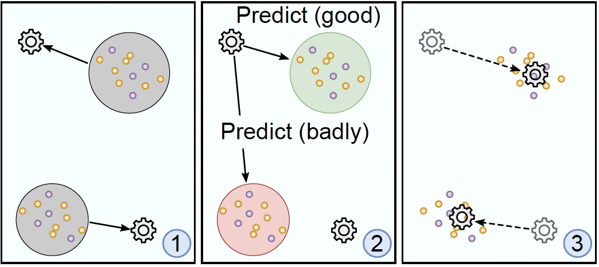

# LoE - League of Experts 

(old: **GoN** Gang of Nerds)

## Intro

League of Experts is a ensemble learning algorithm meant to be used primarily in the context of explainable AI (xAI).
The main idea consists of separating the features space into disjunct parts and having on single `Expert` learn some
distinct area of this features space.
Unlike most Ensemble learning systems, there will be only one model of the Ensemble chosen to form a prediction. So,
instead of some voting process, a selection process is employed.

## Method Description

Short introduction on how training works and how predictions are derived.

### Training process

The model is trained incrementally in steps, outlined as follows:

- Models are places randomly within the feature space
- Iteratively (`n training steps`):
    - Each data points gets assigned its `closest` (determined by a metric of closeness, e.g., eucldian distance) nodel.
    - Each model then learns its closest assigned data points (e.g., a classiifaction task)
    - Each now-trained model predicts **all** data points
        - Each correct prediction will add some directional force to the model pointing to the given data point
        - Each model moves a step (with a decaying `step size`) in the direction of the accumulated force
- After training the best found position for each model during the training cycle is recovered

### Prediction

The model closest to the data point is found which will predict and will predict the data point. No other models will be
asked.

## Properties

The method can be used with any model which features a `.fit()` and `predict()` method (basically `scikit-learn`-like
models.

## How to use
Please refer to the `examples` folder for a tutorial on how to use the algorithm.

## Installation

Put the directory into your Python path and install the dependencies of the `requirements.txt` as needed.

## Related repositories
This package can be used standalone, but is part of a bigger framework called LoE (League of Experts). The main repository can be found here
- [https://github.com/Mereep/HDTree](HdTree)
- [https://github.com/Mereep/loe](LoE)
- [https://github.com/Mereep/rule_loe](RuleLoE)
- LoEViz

